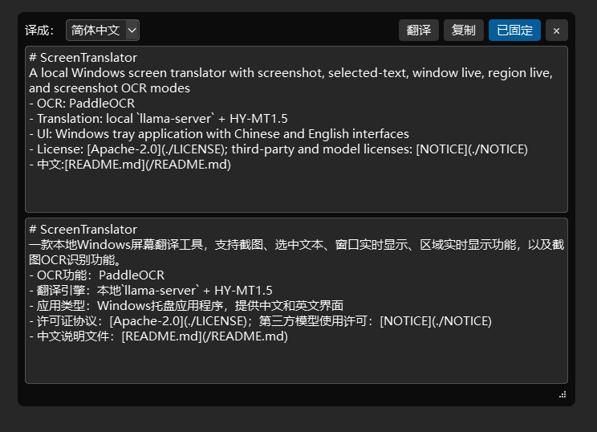
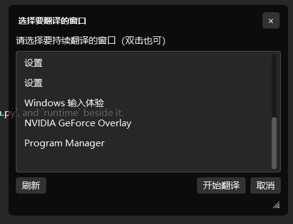
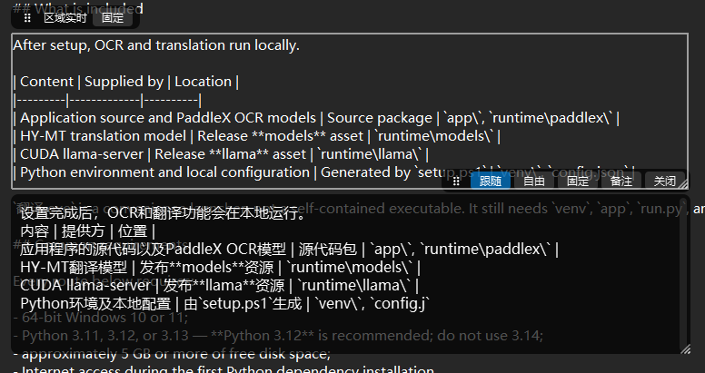
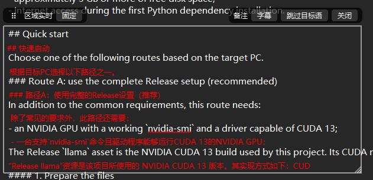

# ScreenTranslator（翻译）

Windows 本地截屏翻译工具：支持截屏、划词、窗口持续翻译、区域实时翻译和截图取字。

- OCR：PaddleOCR
- 翻译：本机 `llama-server` + HY-MT1.5
- 界面：Windows 托盘应用，中英文可切换
- 协议：[Apache-2.0](./LICENSE)；第三方和模型许可见 [NOTICE](./NOTICE)
- English: [README.en.md](./README.en.md)

## 基础说明

安装完成后，OCR 和翻译都在本机运行。

软件由三部分组成：

| 内容 | 来源 | 放置位置 |
|------|------|----------|
| 程序源码、PaddleX OCR 模型 | 源码包 | `app\`、`runtime\paddlex\` |
| HY-MT 翻译模型 | Releases 的 **models** 附件 | `runtime\models\` |
| llama-server（CUDA 版） | Releases 的 **llama** 附件 | `runtime\llama\` |
| Python 环境和本机配置 | 运行 `setup.ps1` 后生成 | `venv\`、`config.json` |

`翻译.exe` 是便捷启动器，不是包含全部依赖的单文件程序；它仍需要同目录下的 `venv`、`app`、`run.py` 和 `runtime`。

## 通用运行条件

无论选择下面哪条路线，电脑都需要满足：

- Windows 10/11 64 位；
- Python 3.11、3.12 或 3.13，推荐 **Python 3.12**，不要使用 3.14；
- 至少约 5 GB 可用磁盘空间；
- 首次安装 Python 依赖时可以联网。

## 快速开始

先根据电脑条件选择一条路线。

### 路线 A：直接使用 Releases 中的整套资源（推荐）

在上述通用条件基础上，这条路线还需要：

- NVIDIA 显卡，`nvidia-smi` 可以正常运行，驱动能够使用 CUDA 13；

Releases 中的 `llama` 附件就是本项目当前使用的 NVIDIA CUDA 13 版本，所需 CUDA 运行库 DLL 已包含在附件中，不需要另外安装 CUDA Toolkit。

#### 1. 准备文件

1. 下载并解压源码包。源码包已经包含 `runtime\paddlex\official_models`。
2. 在 Releases 下载 **models**、**llama** 两个附件。
3. 把两个附件都解压到项目的 `runtime\` 目录：**models** 解压后形成 `runtime\models\`，**llama** 解压后形成 `runtime\llama\`。

最终目录应为：

```text
ScreenTranslator\
  run.py
  翻译.exe
  app\
  runtime\
    models\
      HY-MT1.5-1.8B-Q4_K_M.gguf
    llama\
      llama-server.exe
      *.dll
    paddlex\
      official_models\
        PP-OCRv6_medium_det\
        PP-OCRv6_medium_rec\
```

#### 2. 安装并检查

在项目根目录打开 PowerShell：

```powershell
# 仅在提示脚本未签名时执行；只影响当前 PowerShell 窗口：
Set-ExecutionPolicy -Scope Process Bypass -Force

.\setup.ps1
.\setup.ps1 -Check
```

浏览器下载的压缩包可能带有“来自互联网”标记，`RemoteSigned` 仍会拦截其中未签名的脚本。也可以在解压前打开压缩包“属性”并勾选“解除锁定”；如果已经解压，可执行：

```powershell
Unblock-File .\setup.ps1
Get-ChildItem .\scripts -Recurse -Filter *.ps1 | Unblock-File
```

`setup.ps1` 会创建 `venv`、安装依赖、生成本机 `config.json`，并自动选择 GPU 配置。

#### 3. 启动

双击 `翻译.exe`，或在 PowerShell 执行：

```powershell
venv\Scripts\pythonw.exe run.py
```

### 路线 B：电脑不符合默认条件

| 情况 | 处理方式 |
|------|----------|
| 没有 NVIDIA 显卡 | 使用下面的 CPU 安装命令；不要使用 Releases 中默认的 CUDA `llama` 附件 |
| NVIDIA 驱动或 CUDA 版 llama 无法启动 | 改用 CPU 模式和 CPU 版 llama |
| 没有 Releases 附件 | 让脚本从官方来源下载缺失的模型和 llama |
| 没有 Python，或只有 Python 3.14 | 安装 Python 3.12 后重新执行安装 |
| 安装了多个 Python | 用 `-Python` 指定 Python 3.11～3.13 的完整路径 |

#### 无 NVIDIA：CPU 一键安装

只需源码包即可执行；如果已经有 Releases 的 `models` 附件，脚本会保留并跳过重复下载。

```powershell
.\setup.ps1 -CpuOnly -DownloadRuntime
.\setup.ps1 -Check
```

CPU 模式可以使用，但 OCR 和翻译速度会明显慢于 NVIDIA GPU。

如果已经解压过默认 CUDA `llama`，需要先用 CPU 版本替换它：

```powershell
.\scripts\download_runtime.ps1 -CpuOnly -SkipModel -Force
.\setup.ps1 -CpuOnly
```

#### 有 NVIDIA，但没有 Releases 附件

```powershell
.\setup.ps1 -DownloadRuntime
.\setup.ps1 -Check
```

脚本会检测 NVIDIA；检测不到时会自动改用 CPU 配置。

#### 指定 Python 3.12

```powershell
.\setup.ps1 -Python "C:\Path\To\Python312\python.exe"
```

没有 Python 时可先安装：

```powershell
winget install Python.Python.3.12
```

## 功能展示

| 截图翻译 | 选择窗口持续翻译目标 |
|:---------:|:--------------------:|
|  |  |

| 持续翻译字幕显示 | 区域实时翻译备注模式 |
|:----------------:|:--------------------:|
|  |  |

字体大小可在“设置 → 常规 / 窗口翻译 / 区域翻译”中分别调整；选择“默认”会保留软件原有字号，保存后立即生效。

## 切换翻译模型

软件不会自动下载额外模型。需要切换时：

1. 自行下载兼容 `llama.cpp` 的 `.gguf` 翻译模型。
2. 把模型文件直接放入项目的 `runtime\models\`，不要再套一层目录。
3. 打开“托盘 → 设置 → 高级 → 模型与生成”，选择模型并保存。
4. 退出并重新启动软件，新模型才会生效。

每次打开设置都会重新扫描模型目录。列表只显示文件头有效的 `.gguf`；模型是否适合翻译、支持当前提示格式以及所需显存，由模型本身决定。

## 默认热键

| 功能 | 热键 |
|------|------|
| 截屏翻译 | Alt+Q |
| 划词翻译 | Alt+W |
| 窗口持续翻译 | Alt+E |
| 区域实时翻译 | Alt+R |
| 截图取字 | Alt+S |

托盘菜单可以打开设置、历史和日志。窗口持续翻译与区域实时翻译同时只能运行一个。

翻译历史默认最多保存 50 条，以明文写入项目目录的 `data.db`。可在“设置 → 常规”关闭后续记录，也可在历史窗口确认后清空。

## 常见问题

| 现象 | 处理 |
|------|------|
| 缺少翻译模型或 llama-server | 解压 Releases 的 **models**、**llama** 两个附件，或运行 `.\setup.ps1 -DownloadRuntime` |
| Paddle 安装失败 | 使用 Python 3.12；仍失败可尝试 `.\setup.ps1 -CpuOnly` |
| GPU/llama 启动失败 | 更新 NVIDIA 驱动，或切换 CPU 路线 |
| 提示程序已在运行 | 检查系统托盘，程序只允许一个实例 |
| 想确认资源是否齐全 | 运行 `.\setup.ps1 -Check` |

日志位置：`app.log`。详细设置说明见设置页面和 [SETTINGS.en.md](./SETTINGS.en.md)。

更详细的 runtime 目录说明见 [runtime/README.md](./runtime/README.md)。

## 其它

模型等第三方许可见 [NOTICE](./NOTICE)。

**本安装说明可能由 AI 生成，请自行核对路径与 Release 文件名后再操作。**
